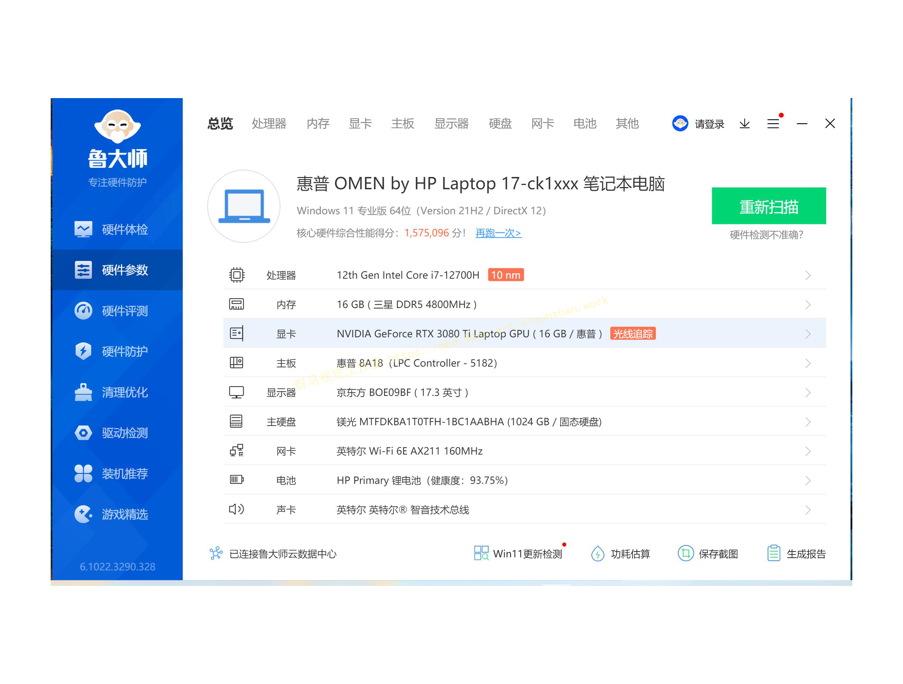

# 1.研究背景

随着市场经济的高速发展，大型货车的载货量越来越大，卸货用换向液压阀的质量直接影响着货车的自动卸货的安全性和稳定性，要求换向液压阀有30MPa以上的耐压，并且对其泄漏性能要求严格。如果换向液压阀质量不合格，在卸货过程中就有可能出现翻车等现象。因此，对这一类超高压控制用换向液压阀的质量与载货量检测显得非常重要。传统的质量检测方法主要以手工装夹，人工操作换向，通过读取机械仪表的方式进行阀体的质量检测，一般不对数据进行处理、记录与分析，无数据的可追溯性。这种落后的检测方式已不能满足现代生产的质量需求，本文设计并实现用于检测载货量的计算机视觉方法。

# 2.图片展示

#### 载货量＆装载负荷检测


#### 车牌识别


#### 以上均支持实时检测＆识别

# 3.视频效果演示

[基于YOLOv7的车辆装载负荷＆车牌检测系统（源码＆教程）_哔哩哔哩_bilibili](https://www.bilibili.com/video/BV1cP4y1o7sN/?vd_source=bc9aec86d164b67a7004b996143742dc)


# 5.YOLOv7算法简介
##  YOLOv7 在 5 FPS 到 160 FPS 范围内，速度和精度都超过了所有已知的目标检测器 
并在V100 上，30 FPS 的情况下达到实时目标检测器的最高精度 56.8% AP。YOLOv7 是在 MS COCO 数据集上从头开始训练的，不使用任何其他数据集或预训练权重。
相对于其他类型的工具，YOLOv7-E6 目标检测器（56 FPS V100，55.9% AP）比基于 transformer 的检测器 SWINL Cascade-Mask R-CNN（9.2 FPS A100，53.9% AP）速度上高出 509%，精度高出 2%，比基于卷积的检测器 ConvNeXt-XL Cascade-Mask R-CNN (8.6 FPS A100, 55.2% AP) 速度高出 551%，精度高出 0.7%。


此外， YOLOv7 的在速度和精度上的表现也优于 YOLOR、YOLOX、Scaled-YOLOv4、YOLOv5、DETR 等多种目标检测器。

# 6.YOLOv7 技术方法
近年来，实时目标检测器仍在针对不同的边缘设备进行开发。例如，MCUNet 和 NanoDet 的开发专注于生产低功耗单芯片并提高边缘 CPU 的推理速度；YOLOX、YOLOR 等方法专注于提高各种 GPU 的推理速度；实时目标检测器的发展集中在高效架构的设计上；在 CPU 上使用的实时目标检测器的设计主要基于 MobileNet、ShuffleNet 或 GhostNet；为 GPU 开发的实时目标检测器则大多使用 ResNet、DarkNet 或 DLA，并使用 CSPNet 策略来优化架构。

YOLOv7 的发展方向与当前主流的实时目标检测器不同，研究团队希望它能够同时支持移动 GPU 和从边缘到云端的 GPU 设备。除了架构优化之外，该研究提出的方法还专注于训练过程的优化，将重点放在了一些优化模块和优化方法上。这可能会增加训练成本以提高目标检测的准确性，但不会增加推理成本。研究者将提出的模块和优化方法称为可训练的「bag-of-freebies」。

对于模型重参数化，该研究使用梯度传播路径的概念分析了适用于不同网络层的模型重参数化策略，并提出了有计划的重参数化模型。此外，研究者发现使用动态标签分配技术时，具有多个输出层的模型在训练时会产生新的问题：「如何为不同分支的输出分配动态目标？」针对这个问题，研究者提出了一种新的标签分配方法，称为从粗粒度到细粒度（coarse-to-fine）的引导式标签分配。

## 该研究的主要贡献包括：

(1) [参考该博客设计了几种可训练的 bag-of-freebies 方法](https://mbd.pub/o/bread/mbd-Y5abmplt)，使得实时目标检测可以在不增加推理成本的情况下大大提高检测精度；

(2) 对于目标检测方法的演进，研究者发现了两个新问题：一是重参数化的模块如何替换原始模块，二是动态标签分配策略如何处理分配给不同输出层的问题，并提出了解决这两个问题的方法； 

(3) 提出了实时目标检测器的「扩充（extend）」和「复合扩展（compound scale）」方法，以有效地利用参数和计算； 

(4) 该研究提出的方法可以有效减少 SOTA 实时目标检测器约 40% 的参数和 50% 的计算量，并具有更快的推理速度和更高的检测精度。

在大多数关于设计高效架构的文献中，人们主要考虑的因素包括参数的数量、计算量和计算密度。下图 2（b）中 CSPVoVNet 的设计是 VoVNet 的变体。CSPVoVNet 的架构分析了梯度路径，以使不同层的权重能够学习更多不同的特征，使推理更快、更准确。图 2 (c) 中的 ELAN 则考虑了「如何设计一个高效网络」的问题。

YOLOv7 研究团队提出了基于 ELAN 的扩展 E-ELAN，其主要架构如图所示。

新的 E-ELAN 完全没有改变原有架构的梯度传输路径，其中使用组卷积来增加添加特征的基数（cardinality），并以 shuffle 和 merge cardinality 的方式组合不同组的特征。这种操作方式可以增强不同特征图学得的特征，改进参数的使用和计算效率。

无论梯度路径长度和大规模 ELAN 中计算块的堆叠数量如何，它都达到了稳定状态。如果无限堆叠更多的计算块，可能会破坏这种稳定状态，参数利用率会降低。新提出的 E-ELAN 使用 expand、shuffle、merge cardinality 在不破坏原有梯度路径的情况下让网络的学习能力不断增强。

在架构方面，[受到该博客启发，E-ELAN 只改变了计算块的架构](https://afdian.net/item?plan_id=7da371aa5ccc11eda97d52540025c377)，而过渡层（transition layer）的架构完全没有改变。YOLOv7 的策略是使用组卷积来扩展计算块的通道和基数。研究者将对计算层的所有计算块应用相同的组参数和通道乘数。然后，每个计算块计算出的特征图会根据设置的组参数 g 被打乱成 g 个组，再将它们连接在一起。此时，每组特征图的通道数将与原始架构中的通道数相同。最后，该方法添加 g 组特征图来执行 merge cardinality。除了保持原有的 ELAN 设计架构，E-ELAN 还可以引导不同组的计算块学习更多样化的特征。
因此，对基于串联的模型，我们不能单独分析不同的扩展因子，而必须一起考虑。该研究提出图 （c），即在对基于级联的模型进行扩展时，只需要对计算块中的深度进行扩展，其余传输层进行相应的宽度扩展。这种复合扩展方法可以保持模型在初始设计时的特性和最佳结构。

此外，该研究使用梯度流传播路径来分析如何重参数化卷积，以与不同的网络相结合。下图展示了该研究设计的用于 PlainNet 和 ResNet 的「计划重参数化卷积」。


# 7.数据集的准备
## 标注收集到的图片制作YOLO格式数据集


自己创建一个myself.yaml文件用来配置路径，路径格式与之前的V5、V6不同，只需要配置txt路径就可以


 train-list.txt和val-list.txt文件里存放的都是图片的绝对路径（也可以放入相对路径）

 如何获取图像的绝对路径，脚本写在下面了（也可以获取相对路径）
```
# From Mr. Dinosaur
 
import os
 
 
def listdir(path, list_name):  # 传入存储的list
    for file in os.listdir(path):
        file_path = os.path.join(path, file)
        if os.path.isdir(file_path):
            listdir(file_path, list_name)
        else:
            list_name.append(file_path)
 
 
list_name = []
path = 'D:/PythonProject/data/'  # 文件夹路径
listdir(path, list_name)
print(list_name)
 
with open('./list.txt', 'w') as f:  # 要存入的txt
    write = ''
    for i in list_name:
        write = write + str(i) + '\n'
    f.write(write)
```
# 8.训练过程

## 运行train.py
train文件还是和V5一样，为了方便，我将需要用到的文件放在了根目录下


路径修改完之后右击运行即可

## 经过漫长的训练过程，YOLOv7相比YOLOv5训练更吃配置尤其是显存，实测GPU 3080ti训练长达40小时以上，建议电脑显存8G以下的谨慎尝试，可能训练的过程低配置的电脑会出现蓝屏等现象皆为显卡过载，使用本文提供的训练好的权重进行预测则不吃配置，CPU也能取得很好的预测结果且不会损伤电脑
附上本文实验设备配置



# 9.测试验证
下面放上对比图：（上面V7，下面V5）


#### 混淆矩阵


#### 参数结果


# 10.项目展示
下图[源码&环境部署视频教程&装载负荷数据集&自定义UI界面](https://s.xiaocichang.com/s/bd31c9)


参考博客[《基于YOLOv7的车辆装载负荷＆车牌检测系统（源码＆教程）》](https://mbd.pub/o/qunma/work)


# 11.参考文献
[1]林永谊,庄铭泳,陈浩鹏.基于数字图像的船舶吃水值检测算法[J].数字化用户.2018,(36).230-231.DOI:10.3969/j.issn.1009-0843.2018.36.215.
[2]林振松.船舶水尺吃水值检测方法研究[J].科技创新与应用.2015,(35).70.
[3]宋涛,吴海,侯培国,等.自然场景下船舶水线提取算法的研究[J].光学技术.2017,(1).61-65.
[4]吴禹辰.基于图像的船舶水尺自动检测系统设计[D].2019
[5]程健,安鸿波,郭一楠,等.一种区域知识引导的船舶吃水线动态识别算法[J].郑州大学学报（工学版）.2021,(3).DOI:10.13705/j.issn.1671-6833.2021.03.008.
[6]马晓波,杜柏松,戴冉.一种船舶吃水测量尺的设计[J].船海工程.2016,(3).35-38.DOI:10.3963/j.issn.1671-7953.2016.03.008.
[7]张帅,朱学海,罗陨飞.船舶水尺智能识别技术的研究与进展[J].检验检疫学刊.2019,(1).101-104.
[8]何红想,阮勇防.船舶水尺观测简易辅助设备的设计[J].船舶标准化与质量.2021,(1).24-25,59.DOI:10.3969/j.issn.1007-9750.2021.01.007.
[9]林王峰.船舶水尺测量研究综述[J].建筑工程技术与设计.2016,(25).1594.DOI:10.3969/j.issn.2095-6630.2016.25.562.
[10]薛银涛.基于卷积神经网络的船舶吃水线检测算法[D].2019
[11]叶晓同,赵鹏,李存军,等.基于超声相控技术的新型船舶计重方法研究[J].传感技术学报.2019,(10).DOI:10.3969/j.issn.1004-1699.2019.10.023.
[12]朱学海,张帅,张东星,等.基于机器视觉与深度学习的船舶水尺智能识别技术研究与应用[J].检验检疫学刊.2019,(2).101-104,110.
[13]张振超.视觉检测技术在中压真空断路器检测线上的研究与实现[D].2015
[14]朱学海,罗陨飞.基于图像处理与深度学习算法的船舶水尺智能读数分析与研究[J].检验检疫学刊.2020,(3).102-105,111.
[15]吴海.基于机器视觉的船舶吃水线检测系统研究[D].2016
[16]郭秀艳.船舶水尺吃水值检测方法研究[D].2014
[17]乔志凯.基于图像处理的船舶水尺检测算法研究[D].2021
[18]李锦峰.基于图像的船舶水尺智能检测技术研究[D].2021
[19]张衎,王剑平,张果,等.图像法水位检测研究进展[J].电子测量技术.2021,(13).DOI:10.19651/j.cnki.emt.2106507.
[20]林王峰.基于视频图像的船舶水尺自动测量系统的设计与实现[D]


---
#### 如果您需要更详细的【源码和环境部署教程】，除了通过【系统整合】小节的链接获取之外，还可以通过邮箱以下途径获取:
#### 1.请先在GitHub上为该项目点赞（Star），编辑一封邮件，附上点赞的截图、项目的中文描述概述（About）以及您的用途需求，发送到我们的邮箱
#### sharecode@yeah.net
#### 2.我们收到邮件后会定期根据邮件的接收顺序将【完整源码和环境部署教程】发送到您的邮箱。
#### 【免责声明】本文来源于用户投稿，如果侵犯任何第三方的合法权益，可通过邮箱联系删除。